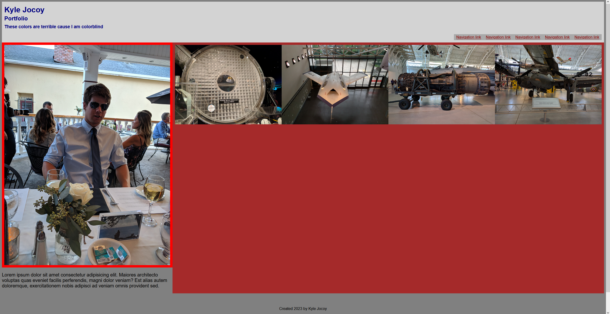
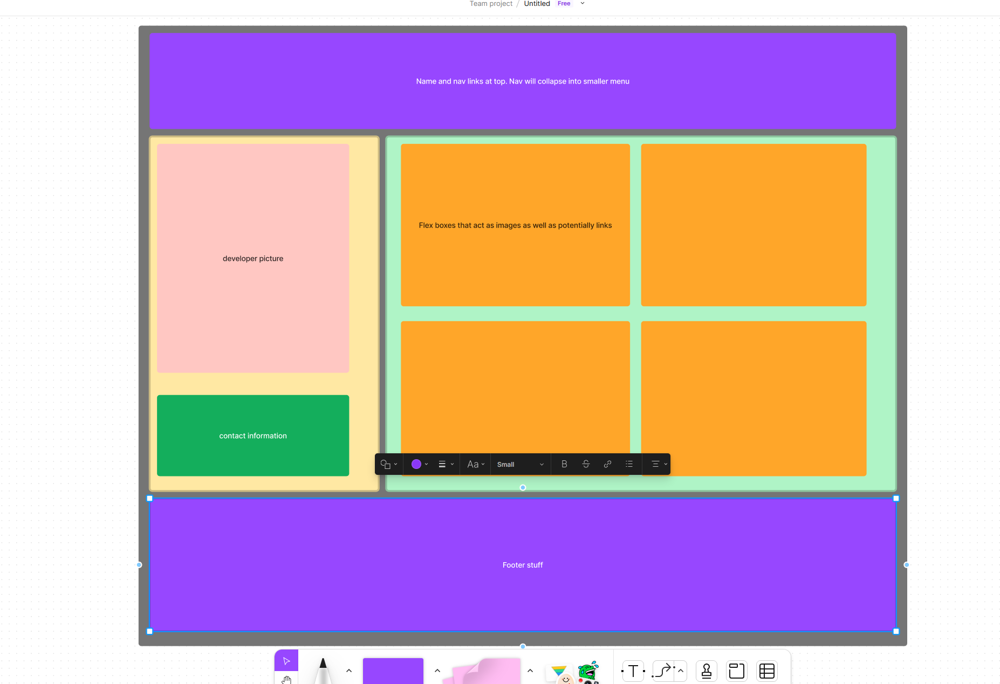
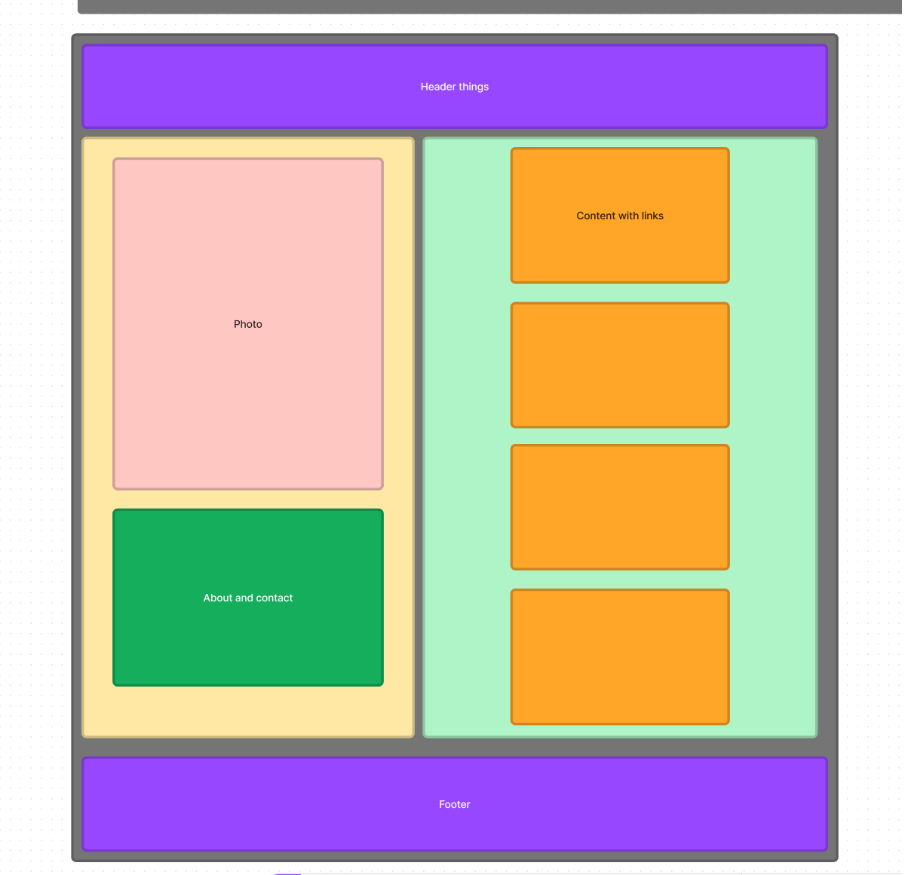

# bootcamp-portfolio

Website for a work portfolio. More work does need to be done. Took me some time to understand how nesting flex boxes works. I also learned there is a grid option for organizing a web page but I don't think it scales as well as Flex from the quick reading I did.

Also, git is confusing still.

# Sources

https://www.figma.com - for quick wireframe  
https://stackoverflow.com/questions/493296/css-display-an-image-resized-and-cropped - how to crop and resize an image in htmnl and css  
https://css-tricks.com/snippets/css/a-guide-to-flexbox/ - for general flex commands  
https://www.quackit.com/css/flexbox/tutorial/nested_flex_containers.cfm - how nesting felx boxes is supposed to work  
https://www.tutorialspoint.com/Proper-use-of-flex-properties-when-nesting-flex-containers - more nesting of flex boxes

## Repo and Website

Link to Repo:  
https://github.com/Kylyote/bootcamp-portfolio

Link to deployed page:  
https://kylyote.github.io/bootcamp-portfolio/

What the trainwreck looks like.  

## Wireframe

Full size  

Smaller size  

